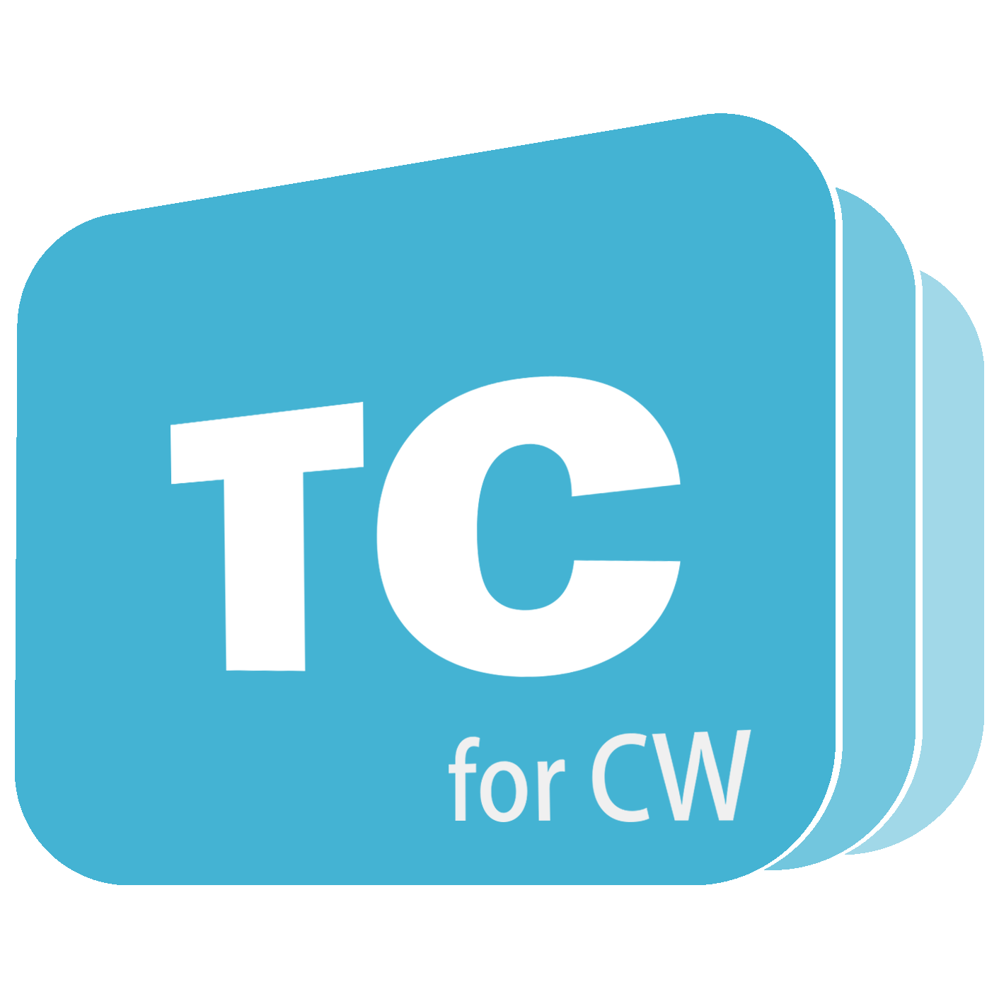

> [!NOTE]
> TeachConnect 有 CW 的插件版啦！
> TeachConnect 的 Discord 服务器：https://discord.gg/s5z94tGbRq

  

  <h1 align="center">
  TeachConnect
</h1>

 全新教师工具（此为教室插件版）

#### [📦 前往本仓库](https://github.com/pyTeachConnect/TeachConnect)

## 安装 & 使用

#### 确认系统需求
首先，确认您的设备是否满足以下需求:

#### 以下为CW（Class Widgets）要求
> [!TIP]
> Class Widgets 现已推出 **📃官方教程** ！请在 [此处](https://www.yuque.com/rinlit/class-widgets_help/) 查看教程。

> [!NOTE]
> **🚧 兼容性：** 现已全面支持 Windows 7！
> 关于Linux：目前可在最新构建中下载，但兼容性可能存疑。

| **🖥️ 操作系统** | **🗄️ 运行内存** | **📦 运行环境** |
| :-----: | :-----: | :------: |
| **Windows 7** 及以上 | ≥4GB | *无特殊要求* |

若已**满足**，请进行接下来的步骤。

#### 下载 Class Widgets
您可在此应用 GitHub 仓库的 Release 页面中下载最新的 Class Widgets:
> **关于测试版：** 在测试版中可提前享用最新的功能，但也可能出现预料之外的问题。

|  **📃 正式版**   |  **🚧 测试版**   |
| :------------------------------: | :------------------------------: |
| [前往 Releases 下载](https://github.com/RinLit-233-shiroko/Class-Widgets/releases) | [前往 Releases 下载](https://github.com/RinLit-233-shiroko/Class-Widgets/releases) |

> [!WARNING]
> 若您无法直接从 GitHub 下载，也可从国内的[网盘镜像](https://www.123pan.com/s/DCyBTd-RAnxH?)中下载
> 
> *网盘密码：RL23

 #### 解压 & 运行
下载完成后，将软件解压到一个**独立的文件夹**，然后在解压后的文件夹找到 `ClassWidgets.exe` 或 `ClassWidgets` 即可运行。

### 之后的操作可参阅[官方文档](https://www.yuque.com/rinlit/class-widgets_help)。

#### 下载 TeachConnect
您可在此应用 GitHub 仓库中下载最新的 TeachConnect:
> **关于测试版：** 在测试版中可提前享用最新的功能，但也可能出现预料之外的问题。
